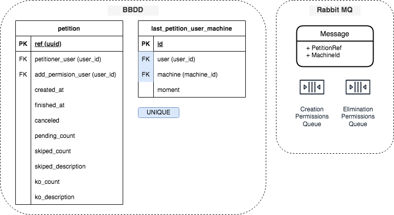

## Alta de permisos en máquinas

Un usuario tiene su llave pública almacenada en BBDD. Dicha llave no es un dato sensible, ya que al tratarse de la llave pública y no la privada (otro usuario no podrá suplantar la identidad de otro con este dato), de modo que será almacena y visualizada sin encriptar.

##### Existen 4 niveles de permisos, por:

- Máquina
- Proyecto (todas las máquinas asociadas a un proyecto)
- Cliente (todas las máquinas asociadas a todos los proyectos de un cliente)
- Tipo (filtro por tipo de máquina, cada cliente puede definir sus tags, pe. por entorno de despliegue test o prod)

Los permisos serán convertidos a string con el siguiente formato:

`{client_id}.{project_id}.{machine_id}#{machine_type}`

> Investigar si sería interesante asociar un proyecto a más de un cliente. En este caso habría que establecer el formato en modo string a:
> {client_id}/{project_id}/{machine_id}/{machine_type}
> 
> Uniendo los separadores en caso de no especificar el campo en cuestión.
>Por ejemplo el permiso para todas las máquinas del proyecto con el id 13 sería:
> 
> /13//

##### Existen 2 tipos de privilegios:

- __administrador:__ podrán dar permisos a otros usuarios
- __ssh:__ podrán acceder a las máquinas

Un usuario podrá asignar otros permisos a otros usuario siempre y cuando asigne permisos para los cuales el sea administrador.

## Asignación de permisos asíncrona

La asignación de privilegios ssh al tratarse de una operación costosa en tiempo debe ser tratada de modo asíncrono. De modo que se usará un sistema de colas con procesos en segundo plano encargado de leer los mensajes de estas colas y realizar la operación pertinente en las máquinas implicadas.

Como medida de seguridad extra los procesos se dividirán en 2 colas:

1. Cola de alta de permiso
1. Cola de baja de permiso

De este modo el proceso encargado del alta de permisos tendrá un retraso de ejecución de X segundos dichas ejecuciones en el tiempo serán definidas con cron jobs, además en el momento de ejecutar la operación del mensaje de la cola, el proceso asegurará que haya superado ese delay (retraso) mínimo.
Esto se debe para disponer de tiempo de reacción en caso de que se haya creado un permiso ssh por error y se cancela la ejecución creando un mensaje en la cola de baja que al ser leido por el proceso de baja que se ejecutará mas recurrentemente y sin ningún delay.

##### Modelo de datos para peticiones:

Para asegurar que la acción que persista finalmente sea la última llevada a cabo,
se realizarán las siguientes acciones para procesar los mensajes:

1. __CUALQUIER MENSAJE ->__ Si la petición vinculada ha sido cancelada:
    - En caso de que haya sido cancelada, la solicitud es descartada, incrementando en uno el contador de descartados de la solicitud y decrementando en uno los pendientes.
    - En caso contrario pasará al siguiente paso
1. __MENSAJE DE ALTA ->__ Se verificara que haya superado el delay establecido:
    - En caso de que la diferencia de tiempo entre el momento de la solicitud y el momento actual no sea igual o superior al del delay establecido el mensaje volverá a introducirse en la cola.
    - En caso contrario pasará al siguiente paso
2. __MENSAJE DE ALTA ->__ Se verificara que el usuario que asignó dichos permisos
siga teniendo permisos de administrador para esa máquina:
    - En caso de que el permiso del usuario solicitante haya sido revocada, la solicitud es descartada, incrementando en uno el contador de descartados de la solicitud y decrementando en uno los pendientes.
    - En caso contrario pasará al siguiente paso
1. __CUALQUIER MENSAJE ->__ Se comprobará el momento de creación de la solicitud, la persona a la que va a asignar el permiso y la máquina asociada. Entonces si:
    - Ya existe un registro que relacione máquina y persona con un momento de solicitud mayor, entonces la solicitud es descartada incrementando en uno el contador de descartados de la solicitud y decrementando en uno los pendientes.
    - No existe un registro que relacione máquina y persona o si existe el momento indicado es inferior al de la solicitud, entonces la solicitud es procesada actualizando el valor del momento de solicitud de la relación previa y decrementando en uno el contador de pendientes. 
